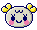

#   Virtual Pet 
Versión del juego [Tamagotchi](https://es.wikipedia.org/wiki/Tamagotchi) donde el objetivo es cuidar de tu mascota virtual.

## 📄 Descripción
Videojuego realizado durante el segundo año de Grado Superior de Desarrollo de Aplicaciones Multiplataforma + Perfil videojuegos y ocio digital (DAMvi). 

🎯 _Objetivo:_ Cuidar de tu mascota: alimentándola, limpiándola y jugando con ella.

➕ _Incluye:_
- Minijuego: Fruit collector.
- Minijuego: Smash groundhogs.

## 🎮 Controles  
- En PC: usa el mouse para interactuar con la pantalla.
- En dispositivos móviles: pulsa con el dedo.
  
## 💻 Tecnologías

- Scriptable objects (permanencia de datos).
- Eventos.

## 📽️ Gameplay (haz clic en la imagen para ver el vídeo)

## ©️ Créditos
- Desarrollo: Selene Milanés.
- Idea y desarrollo original: Tamagotchi (Bandai).
- Arte: los derechos de autor de los assets pertenecen a sus creadores.

---------------------
> Este proyecto es una version educativa del juego Tamagotchi, desarrollado como parte de mi aprendizaje en el desarrollo de videojuegos con Java. Quiero aclarar que este trabajo es estrictamente no comercial y ha sido creado con fines educativos para mejorar mis habilidades en programación y diseño de juegos.

> Todo el crédito por el juego original Tamagotchi pertenece a sus respectivos creadores y propietarios. Mi intención con este proyecto no es comercializar, distribuir, o competir con el producto original, sino simplemente rendir homenaje al juego que me inspiró a aprender más sobre desarrollo de videojuegos.
---------------------

> <i>This project is an educational version of the Tamagotchi game, developed as part of my learning process in video game development with Java. I want to clarify that this work is strictly non-commercial and has been created for educational purposes to improve my programming and game design skills.

> All credit for the original Tamagotchi game belongs to its respective creators and owners. My intention with this project is not to commercialize, distribute, or compete with the original product, but simply to pay tribute to the game that inspired me to learn more about video game development.</i>

 

###  No dudes en contactarme para cualquier duda o inquietud 

